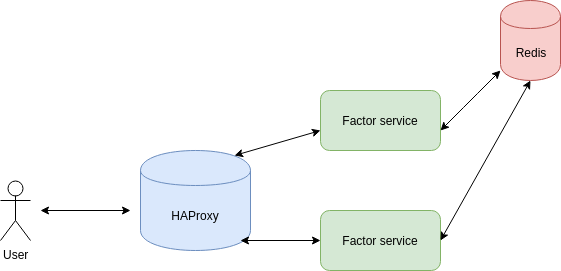

# API design - factorization service

The requirement is to design an API allowing to factorize a given integer. 
Note that the factorization will potentially take a long time to work out a
big integer. Hence, we should take this into account. It means that the API 
can not return immediately the factors as a response. But instead, we might
return an ID which allows to fetch the final result from a no-sql database and in the meanwhile, there
are some workers working for factorization and updating the result in the database.

## Software design

In terms of software design, I will introduce the workers dedicated to calculate
the factors. When there is a factorization demand arriving, the API will just generate 
a task and push it into a queue. While the workers always tend to retrieve the task
from the queue and do the factorization as well as creating a new record in the database.
As soon as the result is worked out, the worker will update the record with the factors.
To make the service scalable, I will create a proxy in front of the services. Now, I
leverage a tradition solution HAProxy as loadbalancer.

 

## Implementation

I got a piece of code in Python. So I decided to adapt it by harnessing
a python web framework [Flask](http://flask.pocoo.org/) and to learn Python as well(why not?).
I use virtualenv to create the Python development environment. Here is the [list][list] of libraries needed
in this project.

```bash
$ source venv/bin/activate
$ pip install -r requirements.txt 
```

Let's take a look at the APIs. The first one is just for test. The second receives a POST request and
retrieve the number and then pushes it into the task queue. At last, it just returns a status code 202 with
the task id. The status code 202 means that the result is in the process of calculation and will be available 
after some time. The third is able to return back the final factors or a temporal status "Calculating..." with 
the task id.

```python
@app.route('/')
def hello():
    return 'Hello Factor app!\n'


@app.route('/factor', methods=['POST'])
def factorization():
    content = request.get_json()
    num = content['number']
    task_id = submit(num)
    # initiate the waiting result into redis
    update(task_id, 'Calculating...')
    # submit the task and return the task id with status code 202
    res = {'task_id': task_id}
    return json.dumps(res), 202


@app.route('/get/<task_id>')
def get_result(task_id):
    res = get(int(task_id))
    if res is None:
        return 'Task_id {} does not exist'.format(task_id), 404
    response = {'result': res.decode("utf-8")}
    return json.dumps(response), 200

```

Let's talk about the task queue. In this version, I tend to implement my own task queue totally in memory which
might be changed to an advanced solution using Redis as queue. The queue is native type. A thread pool is attributed
to the workers who do the factorization work asynchronously. A single-thread pool is created for fetching the task
from the queue continuously.

```python

q = queue.Queue()
executor = concurrent.futures.ThreadPoolExecutor(max_workers=int(os.environ.get("WORKER_NUM")))
service_executor = concurrent.futures.ThreadPoolExecutor(max_workers=1)


class FactorizationTask:
    num = None
    id = None

    def __init__(self, num):
        self.num = num
        self.id = random.randint(0, 1000000000)


def __del__():
    executor.shutdown()
    service_executor.shutdown()


def submit(num):
    """
    Submit a task of factorizing the given number
    :param num: a given integer
    :return: task id with which you can look up the status of task
    """
    task = FactorizationTask(num)
    q.put(task)
    return task.id


def fetch():
    return q.get()


def do_factorization(task):
    print("Task {} with number {} kicked off".format(task.id, task.num))
    res = factors(task.num)
    print("Update result {} for task {}".format(res, task.id))
    update(task.id, ','.join(str(e) for e in res))


def run():
    while True:
        task = fetch()
        executor.submit(do_factorization, task)


service_executor.submit(run)

```

For the complete version, please go to [app.py][app.py]

## Building with docker

Docker is used to deploy the infrastructure. In terms of loadbalancer, I leverage the [HAProxy][HAProxy] of version [dockercloud][dockercloud]
which is capable of auto configuring the IP of services. Here is the [docker-compose.yml][docker-compose.yml].

```bash
# create the stack
$ docker-compose up
```

## Test

```bash
# Factorize 1234
$ curl --header "Content-Type: application/json" \
  --request POST \
  --data '{"number":1234}' \
  http://localhost/factor
  
# Get the result with the task id (260511577)
$ curl http://localhost/get/260511577

```

[list]: https://github.com/EdgarLGB/api-design-factorization/blob/bf1c7fe22e4d8f6c3541cfca45bc553d1aa55c4b/requirements.txt#L1
[app.py]: https://github.com/EdgarLGB/api-design-factorization/blob/bf1c7fe22e4d8f6c3541cfca45bc553d1aa55c4b/app/app.py#L1
[HAProxy]: https://github.com/EdgarLGB/api-design-factorization/blob/bf1c7fe22e4d8f6c3541cfca45bc553d1aa55c4b/docker-compose.yml#L35
[dockercloud]: https://github.com/docker/dockercloud-haproxy/tree/master
[docker-compose.yml]: https://github.com/EdgarLGB/api-design-factorization/blob/bf1c7fe22e4d8f6c3541cfca45bc553d1aa55c4b/docker-compose.yml#L1
